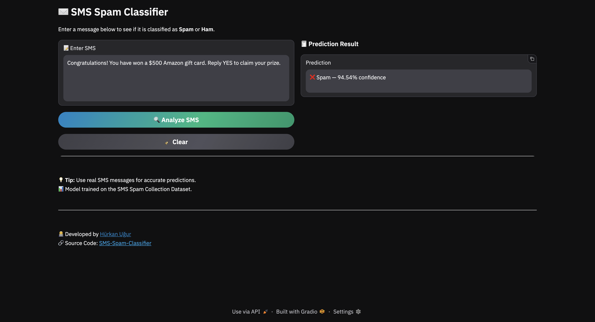

# 📧 SMS Spam Classifier with PyTorch

## 📖 Overview
This project predicts whether a given SMS message is **spam or not** using a **feedforward neural network** implemented in **PyTorch**.

- 🧠 **Neural Network** with multiple hidden layers using **LeakyReLU** activation function and **Dropout**
- ⚖️ **Binary Cross-Entropy (BCE) Loss** for binary classification  
- 🔄 **Adam optimizer** for training  
- 🔀 **Train/Validation/Test split** with mini-batches for robust evaluation  
- 📈 **CountVectorizer feature extraction** for converting text messages into numerical features  
- 💾 **Saving and loading vectorizer** for consistent preprocessing during inference 
- 🎨 **Interactive Gradio Interface** for real-time prediction

---

## 🖼️ Application Screenshot

Below is a preview of the **Gradio Interface** used for real-time classification:



---

## 🧩 Libraries
- **PyTorch** – model, training, and inference  
- **pandas** – data handling  
- **matplotlib** – loss visualization  
- **pickle** – saving/loading vectorizer and trained model
- **Gradio** — interactive web interface for real-time model demos 

---

## ⚙️ Requirements

- Python **3.13+**
- Recommended editor: **VS Code**

---

## 📦 Installation

- Clone the repository
```bash
git clone https://github.com/hurkanugur/SMS-Spam-Classifier.git
```

- Navigate to the `SMS-Spam-Classifier` directory
```bash
cd SMS-Spam-Classifier
```

- Install dependencies
```bash
pip install -r requirements.txt
```

---

## 🔧 Setup Python Environment in VS Code

1. `View → Command Palette → Python: Create Environment`  
2. Choose **Venv** and your **Python version**  
3. Select **requirements.txt** to install dependencies  
4. Click **OK**

---

## 📂 Project Structure

```bash
assets/
└── app_screenshot.png              # Screenshot of the application

data/
└── SMSSpamCollection               # Raw dataset

model/
├── sms_spam_classifier.pth         # Trained model (after training)
└── vectorizer.pkl                  # Saved CountVectorizer for text preprocessing

src/
├── config.py                       # Paths, hyperparameters, split ratios
├── dataset.py                      # Data loading & preprocessing
├── device_manager.py               # Selects and manages compute device
├── train.py                        # Training pipeline
├── inference.py                    # Inference pipeline
├── model.py                        # Neural network definition
└── visualize.py                    # Training/validation plots

main/
├── main_train.py                   # Entry point for training
└── main_inference.py               # Entry point for inference

requirements.txt                    # Python dependencies
```

---

## 📂 Model Architecture

```bash
Input → Linear(256) → LeakyReLU(0.01) → Dropout(0.5)  
      → Linear(128) → LeakyReLU(0.01) → Dropout(0.5)  
      → Linear(64)  → LeakyReLU(0.01) → Dropout(0.5)  
      → Linear(32)  → LeakyReLU(0.01) → Dropout(0.5)  
      → Linear(1)   → Sigmoid(Output)
```

---

## 📂 Train the Model
Navigate to the project directory:
```bash
cd SMS-Spam-Classifier
```

Run the training script:
```bash
python -m main.main_train
```
or
```bash
python3 -m main.main_train
```

---

## 📂 Run Inference / Make Predictions
Navigate to the project directory:
```bash
cd SMS-Spam-Classifier
```

Run the app:
```bash
python -m main.main_inference
```
or
```bash
python3 -m main.main_inference
```
